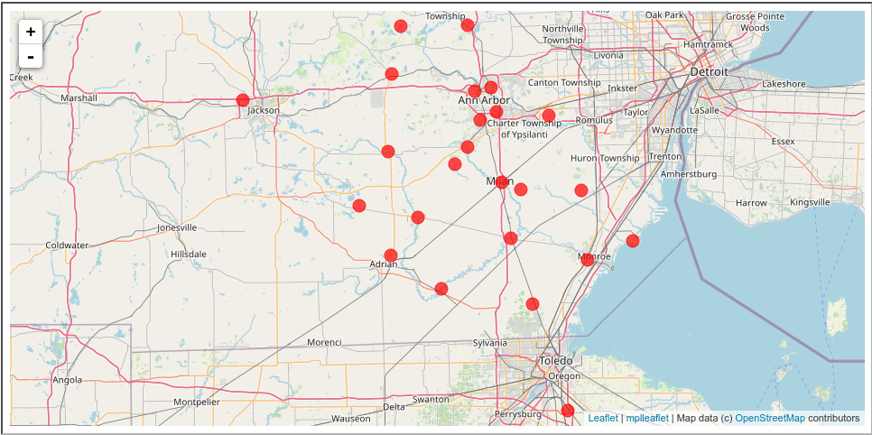
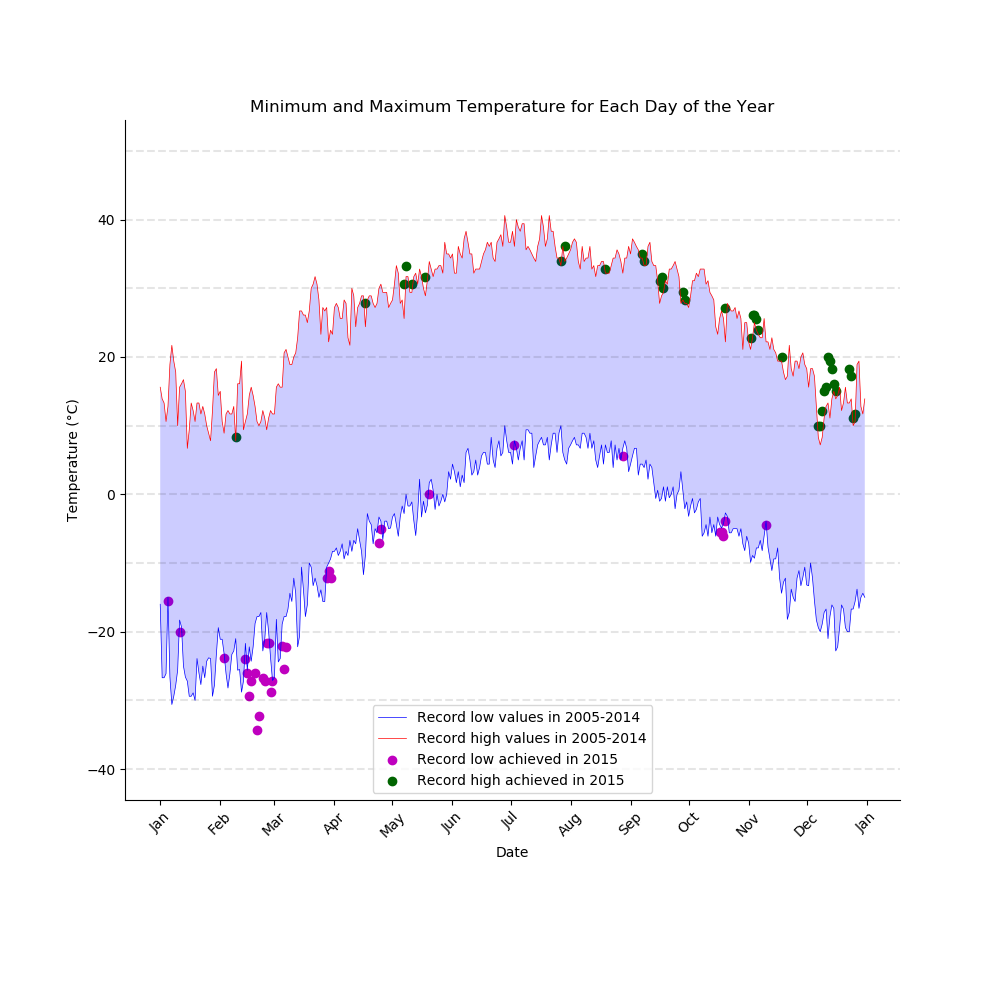

# Plotting Weather Patterns

A NOAA dataset has been located in the file *data/temperature_data.csv*. This will be used in this analysis project. This data is a subset of The National Centers for Environmental Information (NCEI) [Daily Global Historical Climatology Network](https://www1.ncdc.noaa.gov/pub/data/ghcn/daily/readme.txt) (GHCN-Daily). The GHCN-Daily is comprised of daily climate records from thousands of land surface stations across the globe.  

The data is already tidy, as in every row represents a unique observation. Every column corresponds to a single data aspect of a certain observation.  

Dataset will contain temperature data for years 2005-2015.  

The data you have been given is near **Ann Arbor, Michigan, United States**, and the stations the data comes from are shown on the map below.

Dataset contains following variables: 

* **id** : station identification code
* **date** : date in YYYY-MM-DD format (e.g. 2012-01-24 = January 24, 2012)
* **element** : indicator of element type
    * TMAX : Maximum temperature (tenths of degrees C)
    * TMIN : Minimum temperature (tenths of degrees C)
* **value** : data value for element (tenths of degrees C)  

In this analysis, I will:

1. Plot a line graph depicting the record high and record low temperatures of each day of the year over the period of 2005-2014. Area between record high and low temperature lines will be shaded.
2. Overlay a scatter of the 2015 data for any points (highs and lows) for which the ten year record (2005-2014) record high or record low was broken in 2015.
3. Create a nice visualization that is not misleading or confusing.

### The Resulting Plot

